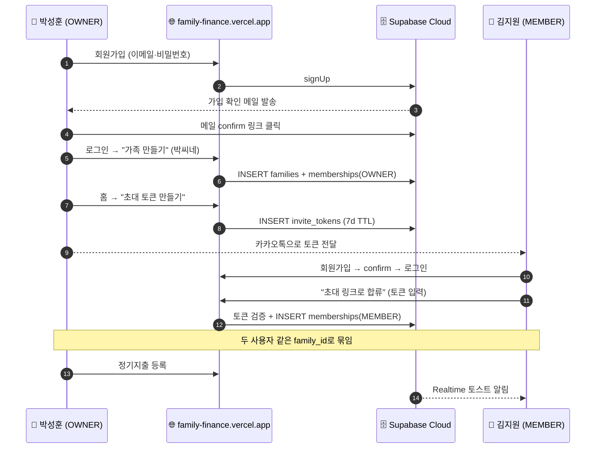
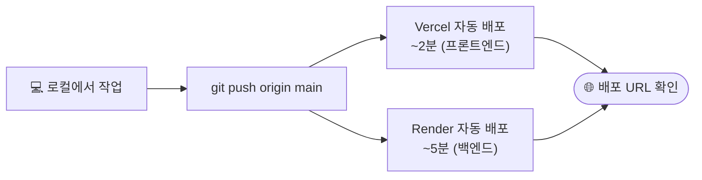

# 무료 서비스로 실제 배포 가이드

**전제**: [`SETUP_LOCAL.md`](./SETUP_LOCAL.md)로 로컬에서 동작 확인이 끝났다.
**목표**: 인터넷에서 가족 누구나 접속 가능한 PWA로 띄우기. **월 ₩0**.
**소요 시간**: 평균 1~2시간 (계정 가입 포함, 가입돼 있으면 30분).

---

## 0. 전체 구성도

```mermaid
flowchart TB
    U["👨‍👩‍👧 가족 모바일/데스크탑"]
    U -->|HTTPS| V

    subgraph FRONT["🌐 Vercel · 무료 100 GB/월"]
        V["React PWA<br/>family-finance.vercel.app"]
    end

    V -->|/api/* 요청| R

    subgraph API["⚙️ Render Free · 무료 750h/월"]
        R["Node Fastify API<br/>family-finance-api.onrender.com<br/>━━━━━━━━━━━━━━<br/>15분 idle 후 sleep<br/>cold start 30~60초"]
    end

    R -->|REST / WebSocket| S

    subgraph BAAS["🗄️ Supabase Free · 무료"]
        S[("Postgres + Auth + Realtime<br/>xxx.supabase.co<br/>━━━━━━━━━━━━━━<br/>500 MB DB · 50k MAU · 2 GB egress")]
    end

    GHA["⏰ GitHub Actions<br/>keepalive cron<br/>KST 07~23시<br/>2,000분/월"]
    GHA -.->|매 10분 핑| R

    style FRONT fill:#1e3a2a,stroke:#5ad19a
    style API fill:#3a2e1e,stroke:#f0a868
    style BAAS fill:#1e2e3a,stroke:#5b8def
```



**합계: 월 ₩0** — 단, 한도 초과 시 자동 차단되도록 알람 권장 (§9 비용 모니터링 참고).

---

## 1. 사전 준비 — 필요한 계정 4개

각각 GitHub 계정으로 가입하면 빠릅니다.

| 서비스 | 가입 URL | 필요 정보 |
|---|---|---|
| Supabase | https://supabase.com | GitHub OAuth |
| Vercel | https://vercel.com | GitHub OAuth |
| Render | https://render.com | GitHub OAuth |
| GitHub | https://github.com | 이미 있음 (코드 푸시용) |

신용카드 등록 **불필요** (무료 티어 한도 안에서 동작).

---

## 2. Supabase Cloud 프로젝트 만들기

### 2-1. 프로젝트 생성

1. https://supabase.com/dashboard 접속 → "New project"
2. 입력:
   - **Name**: `family-finance` (자유)
   - **Database Password**: 안전한 비밀번호 (저장해두기)
   - **Region**: `Northeast Asia (Seoul)` 선택 ★ (한국 사용 시 지연 최소)
   - **Pricing Plan**: Free
3. "Create new project" → 약 2분 대기

### 2-2. 마이그레이션 적용

방법은 두 가지. 권장은 A.

#### 방법 A — Supabase CLI에서 link + push (권장)

로컬 터미널에서:

```bash
cd /path/to/money-manager

# 프로젝트 연결 (Project Settings → General → Reference ID 복사)
supabase link --project-ref <YOUR_PROJECT_REF>
# 비밀번호 입력 안내 시 위에서 만든 DB 비밀번호 입력

# 로컬 마이그레이션 두 개를 원격에 적용
supabase db push
```

성공 시 `0001_init.sql`, `0002_v0_1_1_patches.sql`이 원격 DB에 적용됩니다.

> 만약 "remote and local migration history are out of sync" 에러가 나면:
> ```bash
> supabase db pull
> # 또는 강제 초기화
> supabase db reset --linked
> ```

#### 방법 B — SQL Editor에 직접 붙여넣기

1. Supabase Dashboard → 왼쪽 메뉴 "SQL Editor" → "New query"
2. `supabase/migrations/0001_init.sql` 내용 전체 복사 → 붙여넣기 → "Run"
3. 같은 방법으로 `0002_v0_1_1_patches.sql`도 실행

### 2-3. 키 확보

Dashboard → Project Settings (왼쪽 톱니바퀴) → API:

- **Project URL**: `https://xxxxx.supabase.co`
- **anon public**: `eyJhbGc...` (긴 JWT, 클라이언트 안전)
- **service_role secret**: `eyJhbGc...` (서버 전용, 절대 클라이언트 노출 금지)

이 세 값을 메모해두세요. 이후 Vercel·Render에 환경 변수로 넣을 겁니다.

### 2-4. Auth 설정 (이메일 인증 자동화)

기본 상태로도 동작하지만, 가족 외엔 가입 못 하게 막고 싶다면:

1. Dashboard → Authentication → Providers → Email
2. **"Confirm email"** ON (가입 시 이메일 인증 필수)
3. Authentication → URL Configuration:
   - **Site URL**: 추후 Vercel 배포 URL로 변경 (예: `https://family-finance.vercel.app`)
   - **Redirect URLs**: 같은 URL 추가
4. Authentication → Email Templates:
   - 가입 확인 메일 내용 한국어로 커스터마이징 가능 (선택)

> **무료 티어 메일 제한**: Supabase 무료 SMTP는 1시간에 3건. 가족 5인 이하라 충분하지만, 더 필요하면 Resend/SendGrid의 무료 티어 연동 가능.

---

## 3. Vercel — 프론트엔드 배포

### 3-1. 프로젝트 import

1. https://vercel.com/new
2. GitHub 리포 선택 (cw-20022379/money-manager)
3. **Configure Project** 화면:
   - **Framework Preset**: `Vite`
   - **Root Directory**: `apps/web` ← 중요. 클릭해서 들어가서 선택
   - **Build Command**: `pnpm build`
   - **Output Directory**: `dist`
   - **Install Command**: `cd ../.. && pnpm install --frozen-lockfile`
     (워크스페이스 의존성 때문에 루트에서 설치)

4. **Environment Variables** 섹션 열고 다음 3개 추가:

| Key | Value | 적용 환경 |
|---|---|---|
| `VITE_SUPABASE_URL` | (Supabase Project URL) | Production, Preview, Development |
| `VITE_SUPABASE_ANON_KEY` | (Supabase anon public) | 동일 |
| `VITE_API_URL` | (아직 모름, 4단계 후 채움) | 동일 |

5. **Deploy** 클릭. 약 2~3분 후 첫 배포 완료.

배포 URL이 발급됨 (예: `https://money-manager-abc123.vercel.app`).

### 3-2. 도메인 정리 (선택)
Project → Settings → Domains:
- `family-finance.vercel.app` 같은 짧은 도메인으로 변경 가능 (선점 안 됐다면).

### 3-3. PWA 설치 가능 여부 확인
배포 URL을 모바일에서 열고 "홈 화면에 추가" → 앱 아이콘으로 설치 가능해야 함. iOS는 16.4+ 필요.

---

## 4. Render — 백엔드 API 배포

### 4-1. Web Service 생성

1. https://dashboard.render.com → "New" → "Web Service"
2. GitHub 리포 선택 (cw-20022379/money-manager)
3. 설정:
   - **Name**: `family-finance-api`
   - **Region**: `Singapore` (한국에서 가장 가까운 free region)
   - **Branch**: `main`
   - **Root Directory**: `apps/api`
   - **Runtime**: `Node`
   - **Build Command**:
     ```
     cd ../.. && pnpm install --frozen-lockfile && pnpm --filter @ffn/api build
     ```
   - **Start Command**:
     ```
     pnpm start
     ```
   - **Instance Type**: `Free`

4. **Environment Variables** (Advanced 펼치기):

| Key | Value |
|---|---|
| `SUPABASE_URL` | (Supabase Project URL) |
| `SUPABASE_ANON_KEY` | (Supabase anon public) |
| `SUPABASE_SERVICE_ROLE_KEY` | (Supabase service_role secret) ★ secret 표시 |
| `API_PORT` | `10000` ★ Render는 자동으로 PORT를 주입하지만 명시 권장 |
| `API_HOST` | `0.0.0.0` ★ 0.0.0.0 필수 (Render가 외부 노출하려면) |
| `VAPID_PUBLIC_KEY` | (5단계에서 생성 후 입력) |
| `VAPID_PRIVATE_KEY` | (5단계에서 생성 후 입력) |
| `VAPID_SUBJECT` | `mailto:본인이메일@example.com` |

5. **Create Web Service** 클릭. 첫 빌드 약 5~8분.

빌드 끝나면 URL이 발급됨 (예: `https://family-finance-api.onrender.com`).

### 4-2. server.ts의 host 바인딩 확인

`apps/api/src/server.ts`가 Render에서 외부 노출되려면 `0.0.0.0`에 바인딩해야 합니다.

현재 코드는 `env.API_HOST`를 읽으므로 위에서 `API_HOST=0.0.0.0`을 설정하면 OK.

또한 Render는 환경변수 `PORT`를 자동 주입합니다. `env.ts`에서 `API_PORT`만 읽고 있어서 안전하지만, 더 견고하게 하려면 `apps/api/src/env.ts`를 한 번 수정:

```ts
API_PORT: z.coerce.number().default(Number(process.env.PORT ?? 3000)),
```

### 4-3. healthz 확인

배포 후 `https://family-finance-api.onrender.com/healthz` 접속 → `{"ok":true, "db":"ok"}` 떠야 정상.

> ⚠ 첫 호출은 cold start로 30~60초 걸릴 수 있습니다.

### 4-4. CORS 설정 — Vercel 도메인 허용

`apps/api/src/server.ts`의 CORS 설정에 Vercel 도메인 추가 필요:

```ts
await app.register(cors, {
  origin: [
    'http://127.0.0.1:5173',
    'http://localhost:5173',
    'https://family-finance.vercel.app',  // 본인 Vercel 도메인으로 교체
  ],
  credentials: true,
});
```

수정 후 commit + push → Render가 자동 재배포.

### 4-5. Vercel에 `VITE_API_URL` 마무리
이제 Render URL이 생겼으니 Vercel Dashboard로 돌아가:

1. Project → Settings → Environment Variables
2. `VITE_API_URL` = `https://family-finance-api.onrender.com`
3. Deployments 탭 → 최신 배포에서 "Redeploy" 클릭

---

## 5. Web Push (VAPID) 키 발급

가족이 앱을 닫아둔 상태에서도 푸시 알림을 받게 하려면 VAPID 키 한 쌍이 필요합니다.

### 5-1. 키 생성

로컬에서 한 번만:

```bash
cd apps/api
pnpm exec web-push generate-vapid-keys --json
```

출력 예시:
```json
{
  "publicKey": "BNxx...AAA",
  "privateKey": "abc...XYZ"
}
```

### 5-2. Render에 등록
Dashboard → Environment 탭:
- `VAPID_PUBLIC_KEY` = publicKey 값
- `VAPID_PRIVATE_KEY` = privateKey 값 ★ secret 표시
- `VAPID_SUBJECT` = `mailto:본인이메일@example.com`

수정 후 자동 재배포.

### 5-3. Vercel에 등록 (공개 키만)
프론트엔드는 publicKey만 필요:

`VITE_VAPID_PUBLIC_KEY` = publicKey 값

> ⚠ privateKey는 **절대** 클라이언트(VITE_*)에 넣지 마세요. publicKey만.

---

## 6. GitHub Actions — keepalive cron (P8)

Render Free는 15분 idle 후 sleep → 다음 호출 cold start 30~60초.
가족이 자주 안 쓰면 매번 한참 기다림.

**해결**: KST 07~23시만 매 10분 간격으로 `/healthz` 핑.

### 6-1. 워크플로우 파일 추가

```bash
mkdir -p .github/workflows
```

`.github/workflows/keepalive.yml` 생성:

```yaml
name: keepalive
on:
  schedule:
    # UTC 기준 22~14시 = KST 07~23시
    - cron: '*/10 22-23,0-14 * * *'
  workflow_dispatch:  # 수동 트리거도 가능

jobs:
  ping:
    runs-on: ubuntu-latest
    steps:
      - name: Wake Render API
        run: |
          curl -fsS --max-time 90 https://family-finance-api.onrender.com/healthz \
            || echo "Healthz failed (cold start ok, will retry next round)"
```

> URL은 본인 Render API 도메인으로 교체.

### 6-2. 한도 계산
- 매 10분 × 16시간 = 96 ping/일
- 한 ping 평균 1~3초 (cold start 시 60초)
- 월 사용: 약 80~150분 (GitHub Actions 한도 2,000분의 4~8%)
- Render 가동: 16h × 31일 = 496시간 (Free 750h의 66%, 안전)

### 6-3. Commit
```bash
git add .github/workflows/keepalive.yml
git commit -m "ci: Render keepalive cron (KST 07~23시)"
git push
```

GitHub Actions 탭에서 다음 cron 실행 확인.

---

## 7. Supabase Realtime · CORS · 사이트 URL 마무리

### 7-1. Supabase에서 사이트 URL 등록
Dashboard → Authentication → URL Configuration:
- **Site URL**: `https://family-finance.vercel.app`
- **Additional Redirect URLs**: `https://family-finance.vercel.app/**` 추가

이걸 안 하면 가입 확인 메일 링크가 localhost로 가서 동작 안 함.

### 7-2. Supabase CORS
대시보드 → Project Settings → API → "Exposed schemas" 기본값 `public`, `graphql_public`. 그대로 두면 됨.

### 7-3. PostgREST Realtime 활성화 확인
마이그레이션에 이미 포함됨 (`ALTER PUBLICATION supabase_realtime ADD TABLE ...`). 적용됐는지:

```sql
-- SQL Editor에서 확인
SELECT * FROM pg_publication_tables WHERE pubname = 'supabase_realtime';
```

`payment_flows`, `accounts`, `cards`, `lifecycle_events`가 보이면 OK.

---

## 8. 첫 사용자(부부 2명) 등록 시나리오



검증: Studio → `memberships` 테이블 → 두 row가 동일 `family_id`인지 확인.

---

## 9. 비용·한도 모니터링

### Supabase
Dashboard → Settings → Usage:
- DB Size: 500 MB 한도. 정상 사용 가족 5인 5년 = 약 24 MB (안전)
- MAU: 50,000 한도. 가족 5명이라 0.01%
- Egress: 2 GB / 월. 정상 사용 100 MB 미만

### Vercel
Dashboard → Settings → Usage:
- Bandwidth: 100 GB / 월. PWA + 가족 5명 = 안전

### Render
Dashboard → 좌상단 메뉴 → Billing → Usage:
- Instance hours: 750 / 월 (keepalive cron으로 약 496시간 사용)
- Build minutes: 500 / 월 (PR마다 한 번씩 빌드)

### GitHub Actions
GitHub → Settings → Billing → Actions:
- Free 2,000분 / 월. 평균 100~150분 사용

---

## 10. 자주 발생하는 문제

### 10-1. Render에서 빌드 실패 (pnpm 못 찾음)
Render는 기본적으로 npm을 사용. Build Command에 `corepack enable && corepack prepare pnpm@10 --activate &&` 를 앞에 붙이거나, 또는 root에 `.npmrc`에 `package-manager-strict=false` 추가.

대안: Render Native runtime을 명시:
```
Build Command: corepack enable pnpm && pnpm install --frozen-lockfile && pnpm --filter @ffn/api build
```

### 10-2. Vercel에서 monorepo 빌드 실패 — "module not found @ffn/shared"
워크스페이스가 제대로 install되지 않음. Install Command를 반드시:
```
cd ../.. && pnpm install --frozen-lockfile
```
로 설정. Root Directory는 `apps/web`이지만 설치는 루트에서.

### 10-3. Render API에서 `Cannot read property 'subscribe' of undefined` (Realtime)
Supabase 클라이언트가 service_role로 만들어졌는데 RLS 우회만 가능하고 Realtime 구독은 안 됨. Realtime은 클라이언트(브라우저)에서 anon key로만 사용. 서버는 push만.

### 10-4. cold start가 너무 답답함
- keepalive cron 시간대 확장 (예: 06~24시)
- 또는 Fly.io Free / Cloudflare Workers로 이전 검토 (cold start 거의 없음)
- 또는 Supabase Edge Functions로 Node API 마이그레이션 (cold ~1초)

### 10-5. iOS Safari에서 푸시 안 옴
iOS 16.4 이상 + PWA 홈 화면 설치 + 권한 허용 필요. 시뮬레이터는 미지원. 실제 iPhone에서 테스트.

### 10-6. 비용이 갑자기 청구됨!
무료 티어 초과 시 자동 차단되도록 설정 가능:
- Supabase: Project Settings → Billing → "Spending caps" 활성화 (Free 플랜은 자동 차단)
- Vercel: Settings → Usage Limits → Hobby plan은 자동 차단
- Render: Free plan은 한도 초과 시 자동 sleep, 자동 청구 없음

---

## 11. 일상 배포 흐름



**PR 브랜치 push** 시 Vercel Preview URL 자동 생성: `https://money-manager-git-<branch>-<user>.vercel.app`

---

## 12. 도메인 연결 (선택, 무료)

`*.vercel.app` 서브도메인이 마음에 안 들면:
- **Cloudflare** 등에서 도메인 구매 (가족 닉네임 .com 등, 연 ₩10,000 내외)
- Vercel Settings → Domains → Add → DNS 안내대로 Cloudflare에 CNAME 추가
- HTTPS 자동 발급 (Let's Encrypt)

또는 무료 서브도메인:
- https://www.eu.org 등 (느림, 비추천)

---

## 13. 다음 단계
- 가족 베타 사용 시작 → 발견된 이슈 GitHub Issues에 정리
- v0.2 계획: 인터랙티브 관계도 그래프, 카드 청구사이클, 현금흐름 캘린더
- v0.3 계획: 마이데이터 수기 업로드, 진실의 원천 잠금 UI, 비상위임자

설계 전반은 `family_finance_navigator_design_v1.md` 참고.
